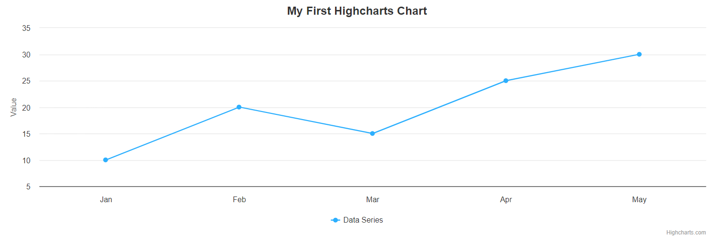
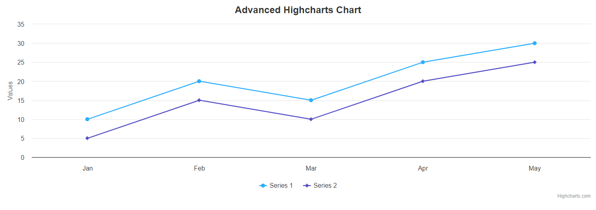

## Introduction

In the field of data analysis and visualization, effectively communicating information in an attractive and illustrating manner is extremely important. Highcharts, a popular JavaScript library, is a powerful tool for creating dynamic and interactive charts. What if you could use Highcharts' power directly in your Python projects with a simple 'pip install' command? 'highcharts-core' is a Python package that seamlessly integrates Highcharts functionality into your Python environment.

## What is `highcharts-core`?
'highcharts-core' is a Python package that connects your Python environment to the Highcharts JavaScript library. By installing this package, you can use Highcharts to its full potential directly within your Python scripts, making data visualization a breeze.

## Installation

Getting started with `highcharts-core` is as easy as running a single command:

```bash
pip install highcharts-core
```
This command fetches and installs the necessary Python bindings for Highcharts, enabling you to integrate Highcharts charts effortlessly into your Python applications.

## Basic Usage:

Once installed, using `highcharts-core` is straightforward. Here's a quick example of creating a simple line chart:

```python
import highcharts
chart = highcharts.Highchart()
options = {
    'title': {
        'text': 'My First Highcharts Chart'
    },
    'xAxis': {
        'categories': ['Jan', 'Feb', 'Mar', 'Apr', 'May']
    },
    'yAxis': {
        'title': {
            'text': 'Value'
        }
    },
    'series': [{
        'name': 'Data Series',
        'data': [10, 20, 15, 25, 30]
    }]
}
chart.set_dict_options(options)
chart.save_file('my_chart.html')
```

In this example, we create a basic line chart with specified x-axis categories, y-axis title, and a data series. The resulting chart is saved as an HTML file (`my_chart.html`), which can be opened in any web browser.



## Advanced Features:

`highcharts-core` supports a wide range of Highcharts features, allowing you to create sophisticated and interactive visualizations. You can customize chart types, add annotations, implement drilldowns, and much more—all from the comfort of your Python environment.

```python
# Advanced example with multiple series and customizations
advanced_chart = highcharts.Highchart()

advanced_options = {
    'title': {
        'text': 'Advanced Highcharts Chart'
    },
    'xAxis': {
        'categories': ['Jan', 'Feb', 'Mar', 'Apr', 'May']
    },
    'yAxis': {
        'title': {
            'text': 'Values'
        }
    },
    'series': [{
        'name': 'Series 1',
        'data': [10, 20, 15, 25, 30]
    }, {
        'name': 'Series 2',
        'data': [5, 15, 10, 20, 25]
    }],
    'plotOptions': {
        'column': {
            'stacking': 'normal'
        }
    }
}
advanced_chart.set_dict_options(advanced_options)
advanced_chart.save_file('advanced_chart.html')
```



## Options
`text`: Specifies the title of the chart.  
`xAxis` > `categories`: Defines the categories (labels) for the X-axis. In this example, the X-axis will have categories 'Jan', 'Feb', 'Mar', 'Apr', and 'May'.  
`yAxis` > `title`: Specifies the title of the Y-axis.  
`series`:This is an array of series objects. Each series object represents a set of data to be plotted on the chart.  
`name`: The name of the series.  
`data`: An array of data points for the series.  
`plotOptions`: Allows you to set options that are common to all plot options (series types).In this example, it is used to configure the column chart options.  
`column`: Specifies that the configuration is for the column chart type.  
`stacking`: Sets the stacking option for the column chart. In this case, it's set to 'normal', meaning the columns are stacked on top of each other.  

## We have Extended Libraries 
[For Stocks charts](https://www.highcharts.com/products/stock/){:target="_blank"}: ```pip install highcharts-stocks```  
[For Maps charts](https://www.highcharts.com/products/maps/){:target="_blank"}:```pip install highcharts-maps```  
[For Gantt charts](https://www.highcharts.com/products/gantt/){:target="_blank"}:```pip install highcharts-gantt```  

## Demo Url:
[https://www.highcharts.com/demo](https://www.highcharts.com/products/stock/){:target="_blank"}

## Conclusion:
Integrating Highcharts into your Python projects becomes a breeze with 'highcharts-core'. This package opens up a world of possibilities for creating visually appealing and informative charts directly from your Python scripts, whether you're a data scientist, analyst, or developer. Investigate the extensive documentation and examples available to fully utilize 'highcharts-core' in your next data visualization project.